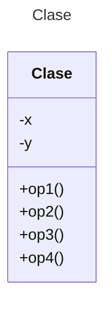

# Proyecto - Java POS - Maven

Proyecto de mini Punto de Venta (POS) en Java con Maven.

## Diagrama de clases
[Editor en línea](https://mermaid.live/)

[Referencia-Mermaid](https://mermaid.js.org/syntax/classDiagram.html)

## Diagrama de clases UML con draw.io
El repositorio está configurado para crear Diagramas de clases UML con ```draw.io```. Para usarlo, agrega un archivo con extensión ```.drawio.png```, haz doble clic sobre el mismo y se activará el editor ```draw.io``` incrustado en ```VSCode``` para edición. Asegúrate de agregar las formas UML en el menú de formas del lado izquierdo (opción ```+Más formas```).

# Generar UML con AppMap

## En Codespaces:
Ejecuta el comando:
```
mvn com.appland:appmap-maven-plugin:prepare-agent test
```
Luego haz clic en el archivo `tmp/appmap/junit/miPrincipal_AppTest_testingList.appmap.json`. Se mostrará el Diagrama de Secuencia.

## En VS Code Local:

Ejecuta las pruebas locales con VS Code.

Luego haz clic en el archivo `tmp/appmap/junit/miPrincipal_AppTest_testingList.appmap.json`. Se mostrará el Diagrama de Secuencia.

# Generar UML usando Navie Chat (IA de AppMap)

## Prompts para generar Diagramas de Clases y Secuencia

```
@diagram Genera un Diagrama de clases para el paquete `miPrincipal` 
@diagram Genera un Diagrama de secuencia para el paquete `miPrincipal`
```
# Explicar el proyecto usando Navie Chat:

## Prompt para explicar el proyecto

```
Explica la programación de este proyecto
```

# Generar el Diagrama de Secuencia con Mermaid 

## Prompts para generar Diagramas de Clase y Secuencia con Mermaid

Para mejores resultados, agrega primero como contexto las clases del proyecto (Codebase) y después aplica los prompts.

```
@mermaid /uml
@mermaid /sequence
```
# Uso del proyecto con Maven

## Compilar
```
mvn compile
```
## Probar N tests
```
mvn test
```
## Probar 1 test
```
mvn test -Dtest="AppTest#testPOS" 
```
## Ejecutar App
```
mvn -q exec:java
```
```
java -cp target/classes miPrincipal.App
```
## Empacar App
```
mvn package
```
## Limpiar binarios
```
mvn clean
```
# Comandos Git-Cambios y envío a Autograding

## Por cada cambio importante que haga, actualice su historia usando los comandos:
```
git add .
git commit -m "Descripción del cambio"
```
## Envíe sus actualizaciones a GitHub para Autograding con el comando:
```
git push origin main
```
Los comandos anteriores están considerados para un ambiente Linux. [Referencia.](https://www.baeldung.com/junit-run-from-command-line)
